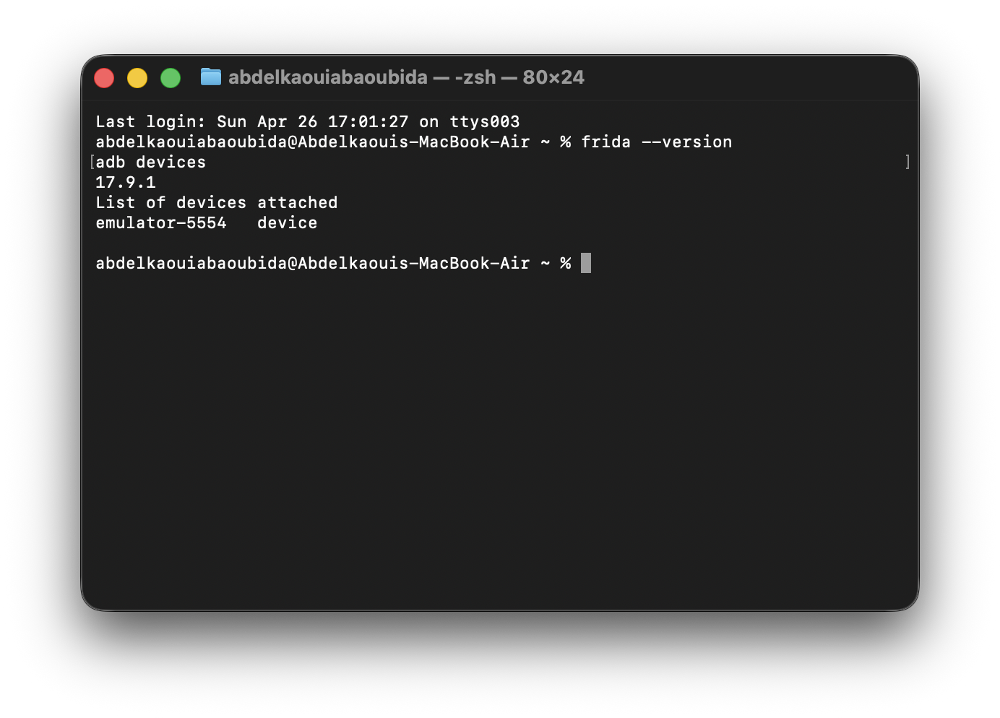
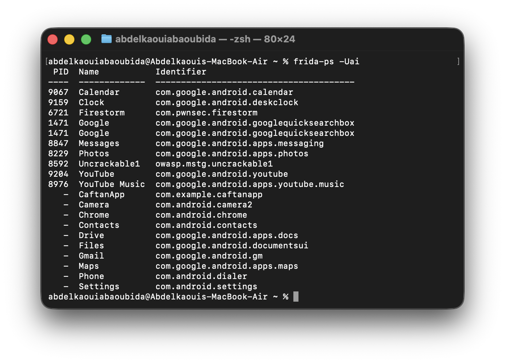
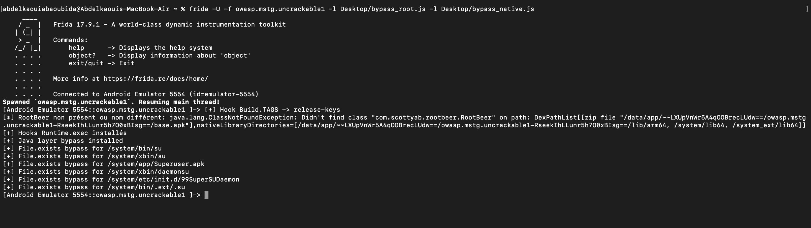

# LAB 11 — Android Root Detection Bypass with Frida (Uncrackable1)

## 📌 Description

Ce lab montre comment préparer un environnement Frida, vérifier la connexion avec un appareil Android, puis injecter des scripts de bypass afin de contourner les mécanismes de détection de root dans l’application **OWASP Uncrackable1**.

---

# 📷 Étape 1 — Vérification de Frida et connexion ADB

Avant de commencer l’injection, il faut vérifier que :

* Frida est correctement installé
* L’émulateur Android est détecté par ADB

Commande utilisée :

```bash
frida --version
adb devices
```

Résultat :

* Frida version **17.9.1**
* Émulateur Android connecté avec l’identifiant **emulator-5554**

<p align="center">
  
</p>

---

# 📷 Étape 2 — Vérification des applications détectées par Frida

Une fois l’émulateur connecté, on vérifie que Frida peut communiquer avec l’appareil et détecter les applications installées.

Commande utilisée :

```bash
frida-ps -Uai
```

Options :

* `-U` → appareil USB / émulateur
* `-a` → afficher toutes les applications
* `-i` → inclure les applications installées

Résultat :

* Détection correcte des applications Android
* Présence de **Uncrackable1**
* Confirmation que Frida communique avec l’émulateur

<p align="center">
  
</p>

---

# 📷 Étape 3 — Injection des scripts de bypass Root Detection

Injection de deux scripts Frida :

* `bypass_root.js` → bypass Java
* `bypass_native.js` → bypass natif (JNI/C++)

Commande utilisée :

```bash
frida -U -f owasp.mstg.uncrackable1 -l Desktop/bypass_root.js -l Desktop/bypass_native.js
```

Options :

* `-f` → lance l’application
* `-l` → charge un script Frida

Résultat :

* Application lancée via Frida
* Hook de `Build.TAGS`
* Neutralisation des vérifications root
* Bypass des fichiers sensibles (`su`, `Superuser.apk`, etc.)
* Hooks Runtime installés

Logs visibles :

```text
[+] Java layer bypass installed
[+] Hooks Runtime.exec installés
[+] File.exists bypass for /system/bin/su
```

<p align="center">
  
</p>

---

# ✅ Résultat Final

Le bypass root fonctionne correctement :

* Frida détecte l’émulateur
* L’application est hookée
* Les contrôles root sont neutralisés
* Uncrackable1 peut être exécutée malgré la détection root

---
